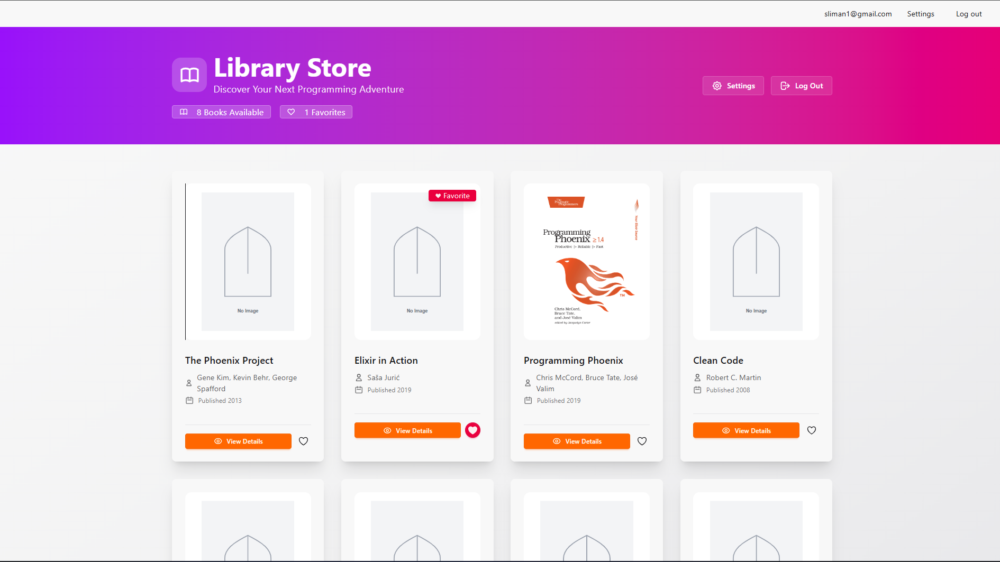
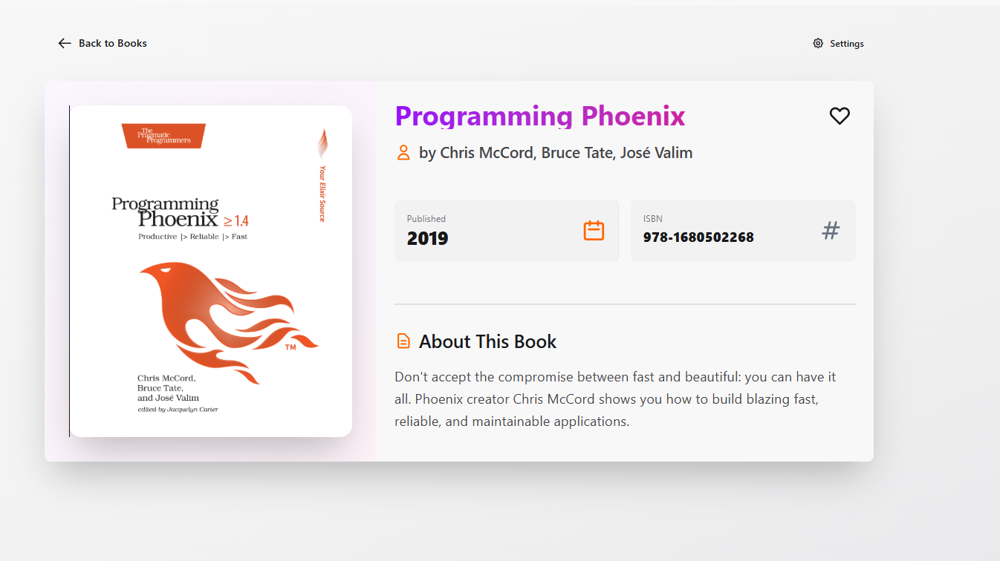

# 📚 Library Store App

A beautiful, modern library management application built with **Phoenix Framework** and **LiveView**. Browse programming books, manage favorites, and enjoy a seamless real-time experience!


## ✨ Features

- 🔐 **User Authentication** - Secure registration and login system
- 📖 **Book Catalog** - Browse a curated collection of programming books
- ❤️ **Favorites System** - Save your favorite books for quick access
- 🎨 **Beautiful UI** - Modern, responsive design with smooth animations
- ⚡ **Real-time Updates** - LiveView for instant UI updates without page refreshes
- 📱 **Responsive Design** - Works perfectly on desktop, tablet, and mobile
- 🖼️ **Image Fallbacks** - Graceful handling of missing book cover images

## 🎯 Core Technologies

- **[Phoenix Framework 1.8](https://www.phoenixframework.org/)** - Web framework
- **[Phoenix LiveView](https://hexdocs.pm/phoenix_live_view/)** - Real-time server-rendered HTML
- **[Ecto](https://hexdocs.pm/ecto/)** - Database wrapper and query generator
- **[PostgreSQL](https://www.postgresql.org/)** - Database
- **[Tailwind CSS](https://tailwindcss.com/)** - Utility-first CSS framework
- **[DaisyUI](https://daisyui.com/)** - Tailwind CSS component library

## 📸 Screenshots

### Books Listing Page
Beautiful grid layout with book covers, favorite indicators, and quick actions.



### Book Details Page
Detailed view with book information, description, and favorite toggle.



### User Settings Page
Modern account management interface with email and password management.


## 🚀 Getting Started

### Prerequisites

Make sure you have the following installed:

- **Elixir** 1.19 or later
- **Erlang** 27 or later
- **PostgreSQL** 12 or later
- **Node.js** 18 or later (for asset compilation)

### Installation

1. **Clone the repository**

```bash
git clone https://github.com/yourusername/library_store_app.git
cd library_store_app
```

2. **Install dependencies**

```bash
mix deps.get
```

3. **Install Node.js dependencies**

```bash
cd assets && npm install && cd ..
```

4. **Configure your database**

Edit `config/dev.exs` and update the database credentials:

```elixir
config :library_store_app, LibraryStoreApp.Repo,
  username: "postgres",
  password: "your_password",
  hostname: "localhost",
  database: "library_store_app_dev",
  stacktrace: true,
  show_sensitive_data_on_connection_error: true,
  pool_size: 10
```

5. **Create and migrate the database**

```bash
mix ecto.create
mix ecto.migrate
```

6. **Seed the database with sample books**

```bash
mix run priv/repo/seeds.exs
```

7. **Start the Phoenix server**

```bash
mix phx.server
```

Now visit [`localhost:4000`](http://localhost:4000) in your browser! 🎉

## 📖 Usage

### Creating an Account

1. Navigate to the home page
2. Click "Register"
3. Enter your email and password (minimum 12 characters)
4. You'll be automatically logged in!

### Browsing Books

1. After logging in, click "Browse Books" or navigate to `/books`
2. Browse the collection of programming books
3. Click the ❤️ button to favorite/unfavorite books
4. Click "View Details" to see more information about a book

### Managing Your Account

1. Click "Settings" in the navigation
2. Update your email address or password
3. Access account information and status

## 🏗️ Project Structure

```
library_store_app/
├── assets/              # Frontend assets (CSS, JS)
├── config/              # Configuration files
├── lib/
│   ├── library_store_app/
│   │   ├── accounts/    # User authentication context
│   │   ├── accounts.ex  # User management functions
│   │   ├── library/     # Book and favorite schemas
│   │   └── library.ex   # Book management functions
│   └── library_store_app_web/
│       ├── components/  # Reusable UI components
│       ├── controllers/ # Traditional controllers
│       └── live/        # LiveView modules
│           ├── book_live/    # Book listing & details
│           └── user_live/    # User auth & settings
├── priv/
│   ├── repo/
│   │   ├── migrations/  # Database migrations
│   │   └── seeds.exs    # Sample data
│   └── static/          # Static assets
└── test/                # Test files
```

## 🗄️ Database Schema

### Users Table
- `id` - Primary key
- `email` - User email (unique)
- `hashed_password` - Encrypted password
- `confirmed_at` - Email confirmation timestamp
- Timestamps

### Books Table
- `id` - Primary key
- `title` - Book title
- `author` - Book author(s)
- `description` - Book description
- `cover_url` - Cover image URL
- `published_year` - Publication year
- `isbn` - ISBN number
- Timestamps

### Favorites Table (Join Table)
- `id` - Primary key
- `user_id` - Foreign key to users
- `book_id` - Foreign key to books
- Timestamps
- Unique constraint on `(user_id, book_id)`

## 🔧 Key Concepts Demonstrated

### Phoenix LiveView
Real-time, interactive pages without writing JavaScript:
- `mount/3` - Initialize page state
- `handle_event/3` - Handle user interactions
- `assign/2` - Update page state
- Automatic DOM updates on state changes

### Ecto Associations
Many-to-many relationship between users and books:
```elixir
# User has many favorite books
many_to_many :favorite_books, Book, join_through: Favorite

# Book has many users who favorited it
many_to_many :favorited_by, User, join_through: Favorite
```

### Context Modules
Clean separation of concerns:
- `Accounts` - User management
- `Library` - Book and favorite management

### Authentication
Secure user authentication using `phx.gen.auth`:
- Password hashing with `pbkdf2_elixir`
- Session-based authentication
- Protected routes
- Email confirmation (can be enabled)

## 🎨 UI/UX Features

- **Gradient Backgrounds** - Beautiful purple to pink gradients
- **Smooth Animations** - Hover effects, transitions, and transforms
- **Responsive Grid** - Adapts from 1 to 4 columns based on screen size
- **Loading States** - Disabled buttons with "Loading..." text
- **Empty States** - Friendly messages when no data is available
- **Image Fallbacks** - SVG placeholders for missing images
- **Icon Integration** - HeroIcons throughout the interface
- **Flash Messages** - Success and error notifications
- **Real-time Updates** - Instant UI updates without page refresh

## 🧪 Testing

Run the test suite:

```bash
mix test
```

## 📝 Available Commands

```bash
mix phx.server          # Start the server
mix test                # Run tests
mix ecto.create         # Create database
mix ecto.migrate        # Run migrations
mix ecto.rollback       # Rollback migration
mix ecto.reset          # Drop, create, and migrate database
mix run priv/repo/seeds.exs  # Seed database
mix format              # Format code
```

## 🤝 Contributing

Contributions are welcome! Please feel free to submit a Pull Request.

1. Fork the project
2. Create your feature branch (`git checkout -b feature/AmazingFeature`)
3. Commit your changes (`git commit -m 'Add some AmazingFeature'`)
4. Push to the branch (`git push origin feature/AmazingFeature`)
5. Open a Pull Request

## 📚 Learning Resources

This project is perfect for learning Phoenix! Here are some resources:

- [Phoenix Documentation](https://hexdocs.pm/phoenix/)
- [Phoenix LiveView Documentation](https://hexdocs.pm/phoenix_live_view/)
- [Elixir Getting Started Guide](https://elixir-lang.org/getting-started/introduction.html)
- [Ecto Documentation](https://hexdocs.pm/ecto/)

## 📄 License

This project is licensed under the MIT License - see the LICENSE file for details.

## 🙏 Acknowledgments

- Phoenix Framework team for the amazing framework
- Chris McCord for Phoenix LiveView
- The Elixir community for their excellent documentation
- All the book authors whose works are featured in this app

Project Link: [https://github.com/slimanibrhaim2/library_store_app](https://github.com/slimanibrhaim2/library_store_app)

---

Made with ❤️ using Phoenix Framework
